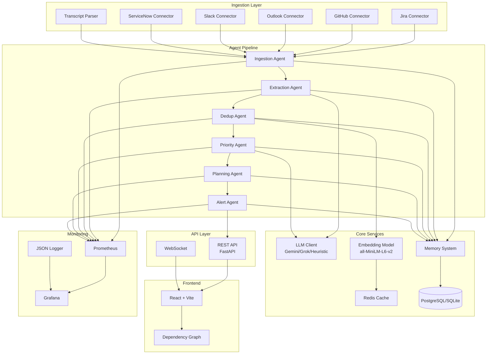
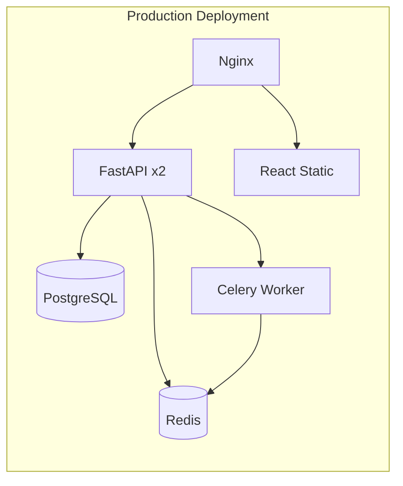

# TaskPilot AI Architecture

## System Overview

TaskPilot AI is a production-grade agentic platform that ingests tasks from multiple sources (Jira, GitHub, Outlook, Slack, ServiceNow), extracts action items from unstructured text, deduplicates across sources, intelligently prioritizes with explainable rationale, generates daily plans, and provides a conversational interface with real-time updates.



## Data Flow

1. **Ingestion** → 6 connectors fetch data from external sources (live API or simulated fallback)
2. **Extraction** → LLM-based agent parses emails/transcripts into structured action items
3. **Deduplication** → Hybrid approach: embedding similarity + rule-based matching
4. **Prioritization** → Deterministic 7-factor scoring + preference learning from feedback
5. **Planning** → Time-blocked daily plan with calendar awareness
6. **Alerting** → Proactive detection of deadlines, blockers, and overload conditions
7. **Delivery** → REST API + WebSocket real-time updates to React frontend

## Architecture Principles

### 1. Resilient LLM Strategy

```
GeminiBackend (PRIMARY)
    ↓ (on failure)
GrokBackend (FALLBACK #1)
    ↓ (on failure)
HeuristicBackend (FALLBACK #2 — rule-based extraction/prioritization)
    ↓ (on failure)
RulesEngineBackend (FALLBACK #3 — keyword-based, last resort)
```

- No single point of failure
- Graceful degradation when APIs are unavailable
- LLM responses cached in Redis with TTL to reduce costs

### 2. Hybrid Deduplication

- **Embedding similarity**: `all-MiniLM-L6-v2` model computes cosine similarity between task titles/descriptions
- **Rule-based matching**: Exact title match, normalized text comparison, source cross-reference
- **Confidence scoring**: Combined score from both approaches with explainability

### 3. Deterministic Prioritization

Scoring uses 7 factors with weighted formula (no LLM in critical path):

| Factor | Weight | Description |
|--------|--------|-------------|
| Deadline Urgency | 35% | Time until deadline (0-100, logarithmic) |
| Severity | 30% | P0=100, P1=75, P2=50, P3=25 |
| Business Impact | 20% | VP escalation=100, customer-facing=70 |
| Dependency Blocking | 15% | Blocks 2+ tasks=100, 1 task=60 |
| Preference Boost | 10% | User feedback multiplier |
| Team Load | 5% | Workload balance across team |
| Historical Patterns | 5% | Peak completion time optimization |

### 4. Production Infrastructure



## Key Design Decisions

| Decision | Rationale |
|----------|-----------|
| **Deterministic scoring over pure LLM** | LLMs are non-deterministic, slow, and expensive for ranking. Deterministic formula is fast, explainable, and auditable. |
| **Hybrid deduplication** | Pure embedding may miss exact ID matches. Pure rules may miss semantic duplicates. Hybrid catches both. |
| **WebSocket for real-time** | Polling would add latency and load. WebSocket enables instant push of plan updates, alerts. |
| **SQLite for dev / PostgreSQL for prod** | Zero-config for development; ACID compliance & concurrency for production. |
| **Celery for background tasks** | Long-running pipeline must not block API. Worker pool processes asynchronously. |
| **Prometheus + Grafana** | Industry standard for metrics collection and visualization. |

## Model Selection

| Model | Purpose | Source | Size |
|-------|---------|--------|------|
| all-MiniLM-L6-v2 | Task dedup embeddings | Hugging Face | 80MB |
| Gemini 2.5 Flash | Primary LLM (extraction) | Google API | API |
| Grok-3 Mini | Fallback LLM | xAI API | API |

All ML models are open-source (Hugging Face) except primary LLM APIs.

## API Endpoints

| Method | Path | Description |
|--------|------|-------------|
| GET | /api/health | System health & connectivity |
| GET | /api/health/live | Liveness probe |
| GET | /api/health/ready | Readiness probe |
| POST | /api/refresh | Run full pipeline |
| GET | /api/plan | Get current daily plan |
| GET | /api/tasks | List tasks (paginated, filterable) |
| GET | /api/tasks/{id} | Get single task |
| POST | /api/chat | Conversational query |
| POST | /api/inject | Inject new task (re-prioritize) |
| POST | /api/feedback | Submit preference feedback |
| GET | /api/dashboard | Full dashboard data |
| GET | /api/weekly-summary | Weekly summary |
| GET | /api/dependency-analysis | Dependency graph data |
| GET | /api/calendar/today | Today's calendar events |
| GET | /api/metrics | Prometheus metrics summary |
| WS | /ws | Real-time updates |

## Security

- **Authentication**: Optional JWT bearer token (configurable)
- **Rate Limiting**: Token-bucket per IP per endpoint (default 60 req/min)
- **Input Sanitization**: Strip control characters, enforce max lengths
- **Secrets Management**: All keys via environment variables or K8s secrets
- **HTTPS**: Terminated at ingress/load balancer level

## Monitoring & Observability

- **Structured Logging**: JSON-formatted logs with correlation IDs
- **Metrics**: Pipeline duration, LLM latency/tokens, HTTP request rate/latency, WebSocket connections
- **Health Probes**: Liveness (is process alive) and Readiness (can handle traffic)
- **Dashboards**: Grafana for metrics visualization
- **Alerting**: Prometheus AlertManager for critical conditions

## Deployment Options

### Development
```bash
# Backend only (SQLite)
cd backend && pip install -r requirements.txt
python -m uvicorn api.main:app --reload

# With Docker
docker compose up backend redis
```

### Production (Docker Compose)
```bash
docker compose up -d
```

### Production (Kubernetes)
```bash
kubectl apply -f k8s/
```

## CI/CD Pipeline

| Stage | Description |
|-------|-------------|
| Lint | Ruff (Python) + TypeScript check |
| Test | Unit + integration with PostgreSQL + Redis |
| Build | Docker images for backend + frontend |
| Deploy | Auto-deploy to staging on main merge |

## Performance Targets

| Metric | Target |
|--------|--------|
| Pipeline runtime (500 tasks) | < 30 seconds |
| API response time (p95) | < 500ms |
| LLM cache hit rate | > 40% |
| System uptime | 99.9% |
| Concurrent users | 10+ |

## Development Guidelines

1. **All new features need tests** — unit + integration
2. **LLM prompts are versioned** — stored in `core/prompts.py`
3. **Connectors follow the base class** — implement `connect()`, `fetch()`, `parse()`
4. **Agents are independent** — can be tested in isolation
5. **DB schema changes need Alembic migration**
